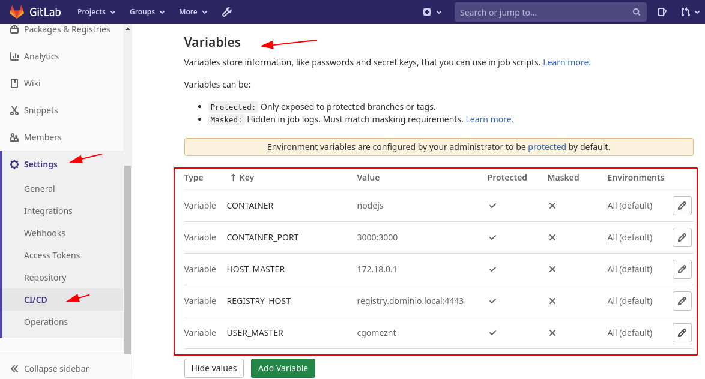

CI/CD con Gitlab Gitlab-runner y con un Docker Registry
=============================================

La idea es que la empresa pueda tener **Integración Continua** 100% funcional. 

Glosario
++++++++

**Nodejs**: Es un lenguaje de programación de código abierto, no compilado es por interpretación, basado en el lenguaje de programación JavaScript.

**CI/CD**: Continuous Integration (CI), Continuous Delivery (CD), Continuous Deployment (CD)

**Continuous Integration (CI)**: funciona insertando pequeños fragmentos de código en la base de código de su aplicación alojada en un repositorio de Git, y para cada inserción, ejecute una canalización de scripts para construir, probar y validar los cambios de código antes de fusionarlos en la rama principal.

**Continuous Delivery, Continuous Deployment (CD)**: consisten en un paso más allá de la (CI), implementando su aplicación en producción en cada impulso a la rama predeterminada del repositorio.

**Docker**: Es una plataforma abierta para desarrollar, enviar y ejecutar aplicaciones. Docker le permite separar sus aplicaciones de su infraestructura para que pueda entregar software rápidamente. Con Docker, puede administrar su infraestructura de la misma manera que administra sus aplicaciones. Al aprovechar las metodologías de Docker para enviar, probar e implementar código rápidamente, puede reducir significativamente la demora entre la escritura del código y su ejecución en producción.

**Imagen**: Una imagen es una plantilla de solo lectura con instrucciones para crear un contenedor Docker según la necesidad.

**Contenedor**: Un contenedor es una instancia ejecutable de una imagen, donde ya esta una aplicación prestando servicio.

**Gitlab**: control de versiones y desarrollo, basado en Git.

**Gitlab-Runer**: funciona con GitLab CI/CD para ejecutar una canalización de scripts.

**Docker Registry**: Almacena y le permite distribuir imágenes de Docker. Altamente escalable.

Introducción
++++++++++++++

Daremos una demostración con un código muy simple realizado con **Nodejs**, este código se estará versionado en un proyecto de **Gitlab**, nuestra aplicación en **Nodejs** se ejecutara en un contenedor **Docker**. La idea es cuando el código sufra modificaciones y realicemos un push para subir las modificaciones al proyecto en **Gitlab**, se ejecuten de forma desasistida una canalización de scripts, que se encargue de construir una nueva imagen de **Docker** con las modificaciones realizadas en el código y esta nueva imagen de **Docker** sera almacenada en el **Docker Registry**, posteriormente en un Servidor que tenga acceso al **Docker Registry** se descargara la nueva imagen de **Docker** y se instanciara esta imagen en un contenedor. El contenedor corriendo en el Servidor tendrá la aplicación con las modificaciones realizadas.

Estaremos Dockerizando Gitlab y Gitlab-Runer en un mismo contenedor y tendremos otro contenedor con Docker Registry, es decir, tendremos dos (2) contenedores de Docker, uno con Gitlab y Gitlab-Runer llamado **gitlab.dominio.local**, y otro con Docker Registry llamado **registry.dominio.local**.

En resumen Gitlab-Runner estará integrado con Gitlab, para que ejecute la canalización de los scripts y el resultado sera una imagen en Docker que se almacenara en Docker Registry y esta nueva imagen sera el contenedor que corra en un servidor.

Se creara un network de Docker llamada **app** del tipo Bridge y ambos contenedores deben estar en la misma network de Docker llamada **app**

En el servidor Host debemos tener creado en el archivo HOSTS los registros de nombre de los contenedores **gitlab.dominio.local** y **registry.dominio.local**, o en su defecto en un DNS.

Empecemos con Dockerizar a Gitlab y Gitlab-Runner en un mismo contenedor, que se llamara **gitlab.dominio.local**:

https://github.com/cgomeznt/Docker/blob/master/guia/dockerizargitlabCentos7.rst

Crear el contenedor Docker Registry por HTTPS, que se llamara **registry.dominio.local**, busca en esta guía **Correr un Registry accesible desde otros servidores**:

https://github.com/cgomeznt/Docker/blob/master/DeployRegistryServer.rst

Realizar la pruebas de ping entre las IP y DNS de los contenedores y también del Host.

Desde el Host hacia los contenedores::

	ping -c2 gitlab.dominio.local
	ping -c2 registry.dominio.local

Entre los contenedores::

	docker exec -ti gitlab.dominio.local ping -c2 registry.dominio.local
	docker exec -ti registry.dominio.local ping -c2 gitlab.dominio.local

Ubicar los certificados creados para el **registry.dominio.local**, debemos crear una carpeta en los servidores que vayan a utilizar el Docker Registry, es decir, en el Host y en el contenedor **gitlab.dominio.local**::

	docker exec -ti gitlab.dominio.local bash
	mkdir -p /etc/docker/certs.d/registry.dominio.local\:4443/

Y dentro de esa carpeta debemos copiar el certificado del servidor y la CA que lo firmo.::

	docker cp certs/registry.crt gitlab.dominio.local:/etc/docker/certs.d/registry.dominio.local\:4443/
	docker cp certs/rootCA.crt gitlab.dominio.local:/etc/docker/certs.d/registry.dominio.local\:4443/

Consultar desde el contenedor el registry las imágenes que tiene.::

	docker exec -ti gitlab.dominio.local curl -k https://registry.dominio.local:4443/v2/_catalog
	{"repositories":[""]}

Consultar desde el Host el registry las imágenes que tiene.::

	curl -k https://registry.dominio.local:4443/v2/_catalog
	{"repositories":[""]}

En el contenedor gitlab descargar una imagen y subirla al registry.::

	docker exec -ti gitlab.dominio.local bash
	docker run hello-world
	docker images
	docker tag hello-world registry.dominio.local:4443/myhello-world
	docker images
	docker push registry.dominio.local:4443/myhello-world

Volvemos a consultar las imágenes que tenga registry.dominio.local, lo podemos hacer desde el host o desde el contenedor::

	curl -k https://registry.dominio.local:4443/v2/_catalog
	{"repositories":["myhello-world"]}

Crear un nuevo proyecto dentro de Gitlab llamado **my*app**.

Vamos a crear ahora un Runner del tipo Shell, necesitamos entrar en en Gitlab -> Admin area -> Overview -> Runner y copiar el token.

Dentro del contenedor **gitlab.dominio.local**, crear un Runner del tipo Shell.::

	docker exec -ti gitlab.dominio.local gitlab-runner register

	Runtime platform                                    arch=amd64 os=linux pid=5550 revision=c1edb478 version=14.0.1
	Running in system-mode.                            
		                                           
	Enter the GitLab instance URL (for example, https://gitlab.com/):
	http://gitlab.dominio.local
	Enter the registration token:
	uPKaQBaMJy2hN5Po25Fg
	Enter a description for the runner:
	[gitlab.dominio.local]: My First Runner Shell
	Enter tags for the runner (comma-separated):
	shell-01
	Registering runner... succeeded                     runner=uPKaQBaM
	Enter an executor: docker, docker-ssh, parallels, shell, docker-ssh+machine, kubernetes, custom, ssh, virtualbox, docker+machine:
	shell
	Runner registered successfully. Feel free to start it, but if it's running already the config should be automatically reloaded! 

Certificar que el runner este creado.

Ir hasta el Proyecto, Setting -> CI/CD -> Runner y verificar que tenga el runner asociado y que este operativo.

Clonar el repositorio del proyecto Gitlab en el host, para trabajar de forma simple.

En el host nos vamos a una carpeta de trabajos y clonamos el repositorio::

	cd laboratorio

	git clone http://gitlab.dominio.local/root/my-app.git
	Clonando en 'my-app'...
	warning: Pareces haber clonado un repositorio sin contenido.

Dentro del proyecto clonado copiamos nuestro codigo en **Nodejs**, este proyecto esta aquí en la carpeta codigo::

	unzip app.zip
	mv app my-app/

En el nuevo proyecto crear dos (2) archivos uno llamado Dockerfile y otro .gitlab-ci.yml.

**NOTA** Se da por entendido que ya se realizaron pruebas para certificar el funcionamiento del gitlab-runner.

Crear la relación confianza desde el contenedor **gitlab.domio.local** hacia el host, para poder mandar a ejecutar comandos docker a través de ssh. ver este link.

https://github.com/cgomeznt/SSH/blob/master/guia/ssh_sin_password.rst

Creamos las variables dentro del proyecto de Gitlab en la sesión de Setting -> CI/CD -> Variables.

* CONTAINER - nodejs	# Este sera el nombre que le daremos al contenedor.

* CONTAINER_PORT - 3000:3000	# La aplicación dentro del contenedor estará en escucha por este puerto.

* HOST_MASTER - 172.18.0.1	# Esta es la dirección IP del adaptador Docker del Host.

* REPO_DEV - registry.dominio.local:4443	# Este es el nombre DNS y puerto del registry.

* USER_MASTER - cgomeznt	# Este es el usuario con privilegios desde el contenedor gitlab.dominio.local hacer ssh en el Host.

Crear el Dockerfile en la raíz del proyecto::

	vi Dockerfile

	# FROM node:12-alpine 
	FROM registry.dominio.local:4443/nodejs
	MAINTAINER Carlos Gomez G cgomeznt@gmail.com
	RUN apk add --no-cache python g++ make
	WORKDIR /app
	COPY app/. . 
	RUN yarn install --production
	CMD ["node", "src/index.js"]

Crear el .gitlab-ci-yml en la raíz del proyecto::

	stages:
	  - test
	  - deploy

	Test:
	  stage: test
	  tags:
	  - shell-01
	  script:
	    - echo "write your test here...!!!"
	    - echo $CONTAINER
	    - echo "$CI_COMMIT_SHORT_SHA - $REGISTRY_HOST/$CI_COMMIT_SHORT_SHA - $CI_COMMIT_SHORT_SHA"
	    - docker build -t $CI_COMMIT_SHORT_SHA .
	    - docker image tag $CI_COMMIT_SHORT_SHA $REGISTRY_HOST/$CI_COMMIT_SHORT_SHA
	    - docker push $REGISTRY_HOST/$CI_COMMIT_SHORT_SHA

	Deploy:
	  only:
	    refs:
	      - master
	  stage: deploy
	  tags:
	    - shell-01
	  script:
	    - touch /tmp/prueba.txt
	    - ssh $USER_MASTER@$MASTER_HOST -p 222 docker rm -f $CONTAINER
	    - ssh $USER_MASTER@$MASTER_HOST -p 222 docker run -dti --name $CONTAINER -p $CONTAINER_PORT $REGISTRY_HOST/$CI_COMMIT_SHORT_SHA
	  # except: ['master']  #Indica en las ramas en las que no se ejecutara esta actividad 
	  # except: ['develop'] #Indica en las ramas en las que no se ejecutara esta actividad 

realizar las pruebas
modificar el codigo y hacer el push
se deben activar los pipeline de script 
se debe crear la imagen
se debe subir la imagen al registry
en el servidor remoto debe matar el contenedor actualmente corriendo
descargar la imagen
instanciar el contenedor

