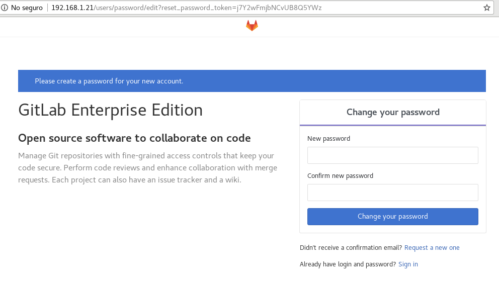
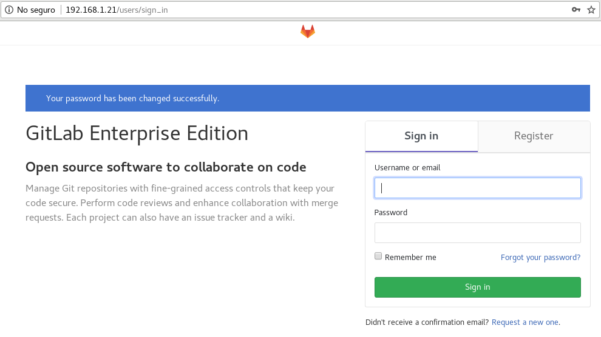

Configuración Inicial de GitLab Enterprise Edition
==================================================

Procedemos a ingresar por medio de un navegador a la IP del servidor en donde instalamos GitLab Enterprise Edition, en este caso: http://192.168.0.21

Cambie la clave del usuario root. 

Luego de cambiar la clave ya puede entrar con el usuario root y la clave que usted fijo.

Listo...!!!
