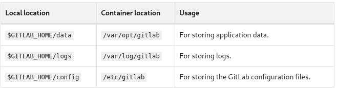

Instalar GitLab Docker images
==============================

Todo siempre desde el link oficial de Gitlab:

https://docs.gitlab.com/omnibus/docker/

Las imágenes de GitLab Docker son imágenes monolíticas de GitLab ejecutando todos los servicios necesarios en un solo contenedor. Si desea instalar GitLab en Kubernetes, ver GitLab Helm Charts. https://docs.gitlab.com/charts/

Encuentre la imagen oficial de Docker de GitLab en GitLab Docker image in Docker Hub::

	https://hub.docker.com/r/gitlab/gitlab-ee/

Las imágenes de Docker no incluyen un agente de transporte de correo (MTA). La solución recomendada es agregar un MTA (como Postfix o Sendmail) que se ejecute en un contenedor separado. Como otra opción, puede instalar un MTA directamente en el contenedor de GitLab, pero esto agrega una sobrecarga de mantenimiento, ya que probablemente tendrá que reinstalar el MTA después de cada actualización o reinicio.

En los siguientes ejemplos, si desea utilizar la última imagen de RC, utilice gitlab/gitlab-ee: rc en su lugar. Pero nosotros utilizaremos gitlab/gitlab-ce.

Prerrequisitos
++++++++++++++++++

Se requiere Docker. Ver la documentación oficial de instalación o en este GitHub la sección de Docker.

Configurar la ubicación de los volúmenes
++++++++++++++++++++++++++++++++++++++++++

Antes de configurar todo lo demás, configure una nueva variable de entorno $GITLAB_HOME que apunte al directorio donde residirán la configuración, los registros y los archivos de datos. Asegúrese de que el directorio exista y de que se haya concedido el permiso adecuado y tenga suficiente espacio.

Para usuarios Linux, configurar la ruta /srv/gitlab::

	export GITLAB_HOME=/srv/gitlab

El contenedor de GitLab usa volúmenes montados en el host para almacenar datos persistentes:

Instalación
+++++++++++++++++

Las imágenes de GitLab Docker se pueden ejecutar de varias formas:

* Usando Docker Engine
* Usando Docker Compose
* Usando Docker swarm mode

En este manual solo dejaremos publicado Docker Engine.

Instalar GitLab con Docker Engine
+++++++++++++++++++++++++++++++++

Puede ajustar estos directorios para satisfacer sus necesidades. Una vez que haya configurado la variable GITLAB_HOME, puede ejecutar la imagen::

	sudo docker run --detach \
	  --hostname gitlab.example.com \
	  --publish 443:443 --publish 80:80 --publish 22:22 \
	  --name gitlab \
	  --restart always \
	  --volume $GITLAB_HOME/config:/etc/gitlab \
	  --volume $GITLAB_HOME/logs:/var/log/gitlab \
	  --volume $GITLAB_HOME/data:/var/opt/gitlab \
	  gitlab/gitlab-ee:latest

Nosotros vamos a utilizar Docker CE::

	sudo docker run --detach \
	  --hostname gitlab.example.com \
	  --publish 443:443 --publish 80:80 --publish 22:22 \
	  --name gitlab \
	  --restart always \
	  --volume $GITLAB_HOME/config:/etc/gitlab \
	  --volume $GITLAB_HOME/logs:/var/log/gitlab \
	  --volume $GITLAB_HOME/data:/var/opt/gitlab \
	  gitlab/gitlab-ce:latest

Esto descargará e iniciará un contenedor de GitLab y publicará los puertos necesarios para acceder a SSH, HTTP y HTTPS. Todos los datos de GitLab se almacenarán como subdirectorios de $GITLAB_HOME. El contenedor se reiniciará automáticamente después de reiniciar el sistema.

Si trabaja con SELinux::

	sudo docker run --detach \
	  --hostname gitlab.example.com \
	  --publish 443:443 --publish 80:80 --publish 22:22 \
	  --name gitlab \
	  --restart always \
	  --volume $GITLAB_HOME/config:/etc/gitlab:Z \
	  --volume $GITLAB_HOME/logs:/var/log/gitlab:Z \
	  --volume $GITLAB_HOME/data:/var/opt/gitlab:Z \
	  gitlab/gitlab-ee:latest

Esto garantizará que el proceso de Docker tenga suficientes permisos para crear los archivos de configuración en los volúmenes montados.

Edita tu tabla de dns local o hosts::

	sudo vi /etc/hosts
	192.168.1.3     gitlab.example.com

El proceso de inicialización puede tardar bastante. Puede realizar un seguimiento de este proceso con::

	sudo docker logs -f gitlab

Después de iniciar un contenedor, puede visitar gitlab.example.com o la IP de tu Host. Puede pasar un tiempo antes de que el contenedor de Docker comience a responder a las consultas. La primera vez que visite GitLab, se le pedirá que configure la contraseña de administrador. Después de cambiarlo, puede iniciar sesión con el nombre de usuario root y la contraseña que configuró.

