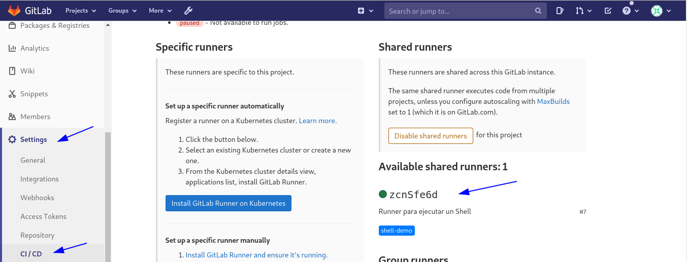
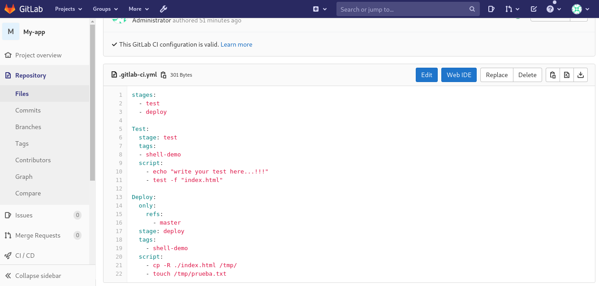
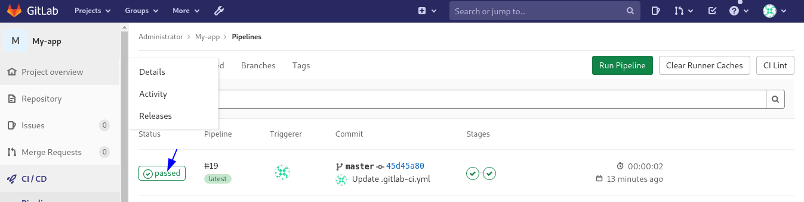
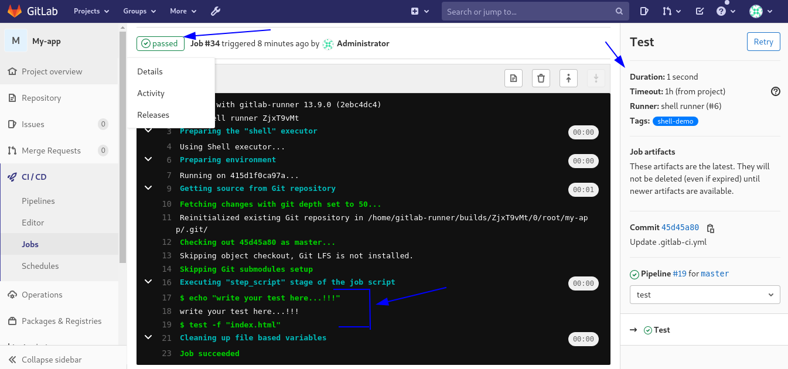

Integración continua con GitLab CI/CD solo para entender
==========

Requerimientos
+++++++++++

Antes de registrar un runner, primero debe tener esta información que se obtiene del servidor en donde tiene el Gitlab:

Obtener el Token::

	Para un runner compartido, haga que un administrador vaya al Área de administración de GitLab y haga clic en Overview -> Runners

	Para un runner de grupo, vaya a Settings -> CI/CD y expanda la sección Runners

	Para un runner específico del proyecto, vaya a Settings -> CI/CD y expanda la sección Runners

Esta es la imagen para obtener los datos para el runner compartido, que es el que utilizaremos en este documento.

.. figure:: ../images/Docker/02.png

Paso 1: creación del repositorio de GitLab
+++++++++++++++++++++++++++++++++++++++++++

Comencemos por crear un proyecto de GitLab y agregarle un archivo HTML. Luego copiará el archivo HTML en el el directorio /tmp, y tambien se creara un archivo nuevo de prueba.

Inicie sesión en su instancia de GitLab y haga clic en Nuevo proyecto.

.. figure:: ../images/CICD/01.png

1.- Dale un nombre de proyecto adecuado.

2.- Opcionalmente, agregue una descripción del proyecto.

3.- Asegúrese de establecer el Nivel de visibilidad en Privado o Público según sus requisitos.

4.- Finalmente haga clic en Crear proyecto

.. figure:: ../images/CICD/02.png

.. figure:: ../images/CICD/03.png

IMPORTANTE; le estamos colocando un DNS en Proyect URL, lo que significa que debes tener eso en tu DNS o en el archivo de hosts de el Docker gitlab-runner. En este ejemplo lo vamos a colocar en el archivo hosts, y la IP sera la que tenga el servidor Docker gitlab::

	docker exec -i -t gitlab-runner /bin/bash
	cat /etc/hosts
		127.0.0.1	localhost
		::1	localhost ip6-localhost ip6-loopback
		fe00::0	ip6-localnet
		ff00::0	ip6-mcastprefix
		ff02::1	ip6-allnodes
		ff02::2	ip6-allrouters
		172.17.0.3	415d1f0ca97a
	echo "172.17.0.2      gitlab.example.com gitlab" >> /etc/hosts

Creemos el archivo HTML. En la página de descripción general de su proyecto, haga clic en Archivo nuevo.

.. figure:: ../images/CICD/04.png

Establezca el nombre del archivo en index.html y agregue el siguiente HTML al cuerpo del archivo:

.. figure:: ../images/CICD/05.png

.. figure:: ../images/CICD/06.png

Haga clic en Commit para aplicar los cambios y crear el archivo.

Paso 2 - Creación de un usuario de implementación
++++++++++++++++++++++++++++++++++++++++++++++

Si no quiere tener comportamientos y errores extraños, cree el usuario de Implementación.

Va a crear un usuario dedicado a la tarea de implementación. Posteriormente, configurará la pipeline de CI/CD para iniciar sesión en el servidor con ese usuario.

En su servidor, cree un nuevo usuario::

	sudo adduser deployer

Se le guiará a través del proceso de creación de usuarios. Introduzca una contraseña segura y, opcionalmente, cualquier otra información de usuario que desee especificar. Finalmente confirme la creación del usuario con Y.

Agregue el usuario al grupo de Docker::

	sudo usermod -aG docker deployer

Esto permite que el implementador ejecute el comando de la ventana acoplable, que es necesario para realizar la implementación.

Paso 3: registrar un Runner de GitLab
++++++++++++++++++++

Empiece por ver este link que le enseñara como registrar el runner contra el Gitlab:

https://github.com/cgomeznt/Gitlab/blob/master/guia/registrargitlabrunner.rst

Con el usuario de implementación vamos a crear un runner con **Executor del tipo SHELL** y utilizaremos los datos que se obtuvierón en los **Requerimientos**::

Si tiene el Gitlab-runner en ejecucion detengalo::

	docker ps
	docker stop gitlab-runner

Coloque como respuesta a las preguntas::

		Enter the GitLab instance URL (for example, https://gitlab.com/):
			http://192.168.1.3
		Enter the registration token:
			diwM-bTpiJxqndAtjacd -> este es el Token y lo obtiene de los Requerimientos.
		Enter a description for the runner:
			Runner para ejecutar un Shell
		Enter tags for the runner (comma-separated):
			shell-demo
		Enter an executor:
			shell

Ejecute el siguiente comando y complete las preguntas::

	docker run --rm -it -v /home/srv/gitlab-runner/config:/etc/gitlab-runner gitlab/gitlab-runner register

Esta seria la ejecución del comando las salidas y los valores que se escribieron::

	docker run --rm -it -v /home/srv/gitlab-runner/config:/etc/gitlab-runner gitlab/gitlab-runner register
		Runtime platform                                    arch=amd64 os=linux pid=7 revision=2ebc4dc4 version=13.9.0
		Running in system-mode.                            
				                                   
		Enter the GitLab instance URL (for example, https://gitlab.com/):
		http://192.168.1.3
		Enter the registration token:
		diwM-bTpiJxqndAtjacd
		Enter a description for the runner:
		[294d980743df]: Runner para ejecutar un Shell
		Enter tags for the runner (comma-separated):
		shell-demo
		Registering runner... succeeded                     runner=diwM-bTp
		Enter an executor: docker, docker+machine, kubernetes, docker-ssh+machine, custom, docker-ssh, parallels, shell, ssh, virtualbox:
		shell
		Runner registered successfully. Feel free to start it, but if it's running already the config should be automatically reloaded! 

Importante recordar estos valores, porque deben estar asociados al proyecto al archivo gitlab-ci.yml y el tipo de ejecución::

	Enter tags for the runner
	Enter an executor

Verificar que Gitlab-runner este en ejecución::

	docker ps
	docker start gitlab-runner

Paso 4: Verificar que el Runner este activo.
++++++++++++++++++++++++++++++++++++++++

Debemos antes de continuar verificar que el Runner se encuentre activo y asociado al proyecto.

Si todo fue bien, ya podremos ver en el servidor de Gitlab nuestro registro del Gitlab-runner.

.. figure:: ../images/CICD/12.png

Pero es importante revisar que el runner este conectado al Gitlab (Pendiente con el archivo hosts en los servidores de Docker), en este caso recuerda que tuve que conectar al gitlab-runner y agregar en el archivo  hosts la ip y DNS del Gitlab, pero la IP que suministra el Docker::

Luego debo verificar en el proyecto que este asociado y conectado el runner, en el menú Settting > CI/CD del proyecto y Runners

Paso 5: configuración del archivo .gitlab-ci.yml
++++++++++++++++++++++++++++++++++++++++

Vas a configurar la pipeline GitLab CI/CD. 

Ahora va a crear el archivo .gitlab-ci.yml que contiene la configuración de la pipeline. En GitLab, vaya a la página de descripción general del proyecto, haga clic en el botón + y seleccione New File. Luego, establezca el nombre del archivo en .gitlab-ci.yml.

(Alternativamente, puede clonar el repositorio y realizar todos los cambios siguientes en .gitlab-ci.yml en su máquina local, luego confirmar y enviar al repositorio remoto).

El archivo tendrá el siguiente contenido::

	stages:
	  - test
	  - deploy

	Test:
	  stage: test
	  tags:
	  - shell-demo
	  script:
	    - echo "write your test here...!!!"
	    - test -f "index.html"

	Deploy:
	  only:
	    refs:
	      - master
	  stage: deploy
	  tags:
	    - shell-demo
	  script:
	    - cp -R ./index.html /tmp/
	    - touch /tmp/prueba.txt

Ya estamos listo para hacer Integración continua. Ahora bien cada vez que ejecutemos un commit el gitlab buscara este archivo y ejecutara secuencialmente sus instrucciones según los stage. Basicamente esto lo que hara es mostrar un echo "write your test here...!!!" en pantalla y en el servidor Docker de Gitlab-runner copiara el index.html y creara un archivo prueba.txt en el directorio /tmp

Cuando realice cualquier commit se vera algo como esto, estara en pending mientras ejecuta todo.

Si no hay errores vera esto

Ahora para ver las salidas debe hacer esto, hacer click en **passed**. Luego hacer click en **Test** y **Deploy** para ver el detalle

.. figure:: ../images/Docker/10.png

Este es el detalle de **Test**

Este es el detalle de **Deploy**

.. figure:: ../images/Docker/09.png

Ahora vamos al servidor de Docker gitlab-runner y veamos que se copiara el archivo index.html y se creara un archivo prueba.txt en /tmp::

	docker exec -i -t gitlab-runner /bin/bash
		root@415d1f0ca97a:/# ls /tmp
			checksums-amd64  checksums-s390x          gitlab-runner_s390x.deb  install-deps
			checksums-arm64  gitlab-runner_arm64.deb  index.html               prueba.txt
		root@415d1f0ca97a:/# cat /tmp/index.html 
			<html>
			<body>
			<h1>My App Website demo de CI/CD</h1>
			</body>
			</html>
		root@415d1f0ca97a:/# 

Listo...!!! esto es un demo muy simple de Integración Continua and Deploy.

