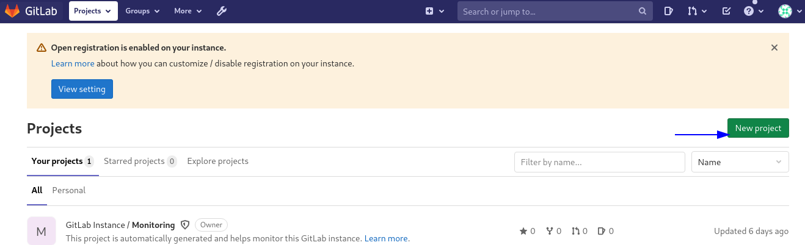
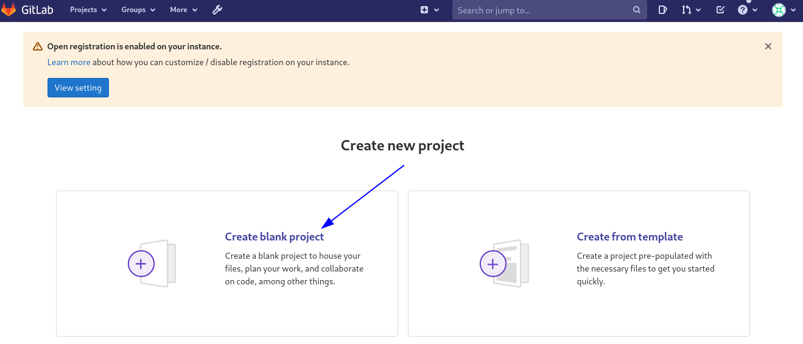
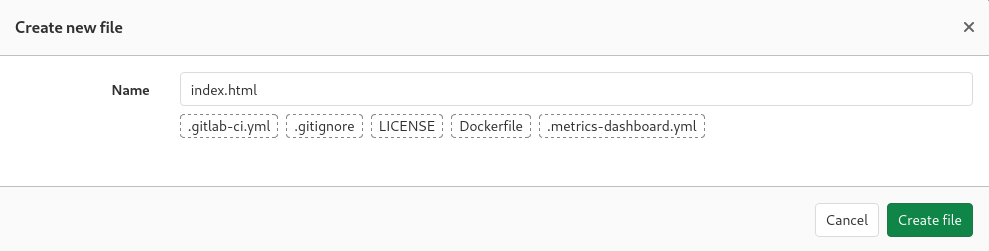

Integración continua con GitLab CI/CD solo para entender
==========

Paso 1: creación del repositorio de GitLab
+++++++++++++++++++++++++++++++++++++++++++

Comencemos por crear un proyecto de GitLab y agregarle un archivo HTML. Luego copiará el archivo HTML en una imagen de Nginx Docker, que a su vez implementará en el servidor.

Inicie sesión en su instancia de GitLab y haga clic en Nuevo proyecto.

1.- Dale un nombre de proyecto adecuado.

2.- Opcionalmente, agregue una descripción del proyecto.

3.- Asegúrese de establecer el Nivel de visibilidad en Privado o Público según sus requisitos.

4.- Finalmente haga clic en Crear proyecto

.. figure:: ../images/CICD/03.png

Creemos el archivo HTML. En la página de descripción general de su proyecto, haga clic en Archivo nuevo.

.. figure:: ../images/CICD/04.png

Establezca el nombre del archivo en index.html y agregue el siguiente HTML al cuerpo del archivo:

.. figure:: ../images/CICD/06.png

Haga clic en Commit para aplicar los cambios y crear el archivo.

Este HTML producirá una página en blanco con un título que muestra Mi sitio web personal cuando se abre en un navegador.

Los Dockerfiles son recetas utilizadas por Docker para crear imágenes de Docker. Creemos un Dockerfile para copiar el archivo HTML en una imagen Nginx.

Vuelva a la página de descripción general del proyecto, haga clic en el botón + y seleccione la opción Nuevo archivo.

.. figure:: ../images/CICD/07.png

Establezca el nombre del archivo en Dockerfile y agregue estas instrucciones al cuerpo del archivo::

	FROM nginx:1.18
	COPY index.html /usr/share/nginx/html

Aplicamos el Commit.

.. figure:: ../images/CICD/08.png

La instrucción FROM especifica la imagen base de Docker, en este caso la imagen nginx: 1.18. 1.18 es la etiqueta de imagen que representa la versión de Nginx. La etiqueta nginx: latest hace referencia a la última versión de Nginx, pero eso podría interrumpir su aplicación en el futuro, por lo que se recomiendan las versiones fijas.

La instrucción COPY copia el archivo index.html en /usr/share/nginx/html en la imagen de Docker. Este es el directorio donde Nginx almacena contenido HTML estático.

No olvidemos hacer clic en Commit para guardar los cambios.
