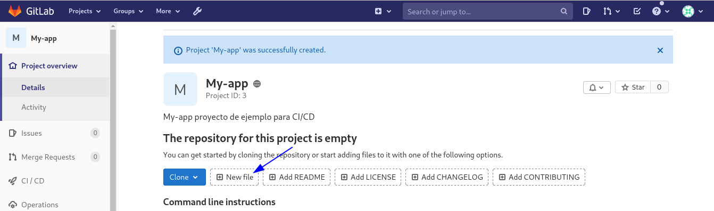

Integración continua con GitLab CI/CD solo para entender
==========

Paso 1: creación del repositorio de GitLab
+++++++++++++++++++++++++++++++++++++++++++

Comencemos por crear un proyecto de GitLab y agregarle un archivo HTML. Luego copiará el archivo HTML en el el directorio /tmp, y tambien se creara un archivo nuevo de prueba.

Inicie sesión en su instancia de GitLab y haga clic en Nuevo proyecto.

.. figure:: ../images/CICD/01.png

1.- Dale un nombre de proyecto adecuado.

2.- Opcionalmente, agregue una descripción del proyecto.

3.- Asegúrese de establecer el Nivel de visibilidad en Privado o Público según sus requisitos.

4.- Finalmente haga clic en Crear proyecto

.. figure:: ../images/CICD/02.png

.. figure:: ../images/CICD/03.png

Creemos el archivo HTML. En la página de descripción general de su proyecto, haga clic en Archivo nuevo.

Establezca el nombre del archivo en index.html y agregue el siguiente HTML al cuerpo del archivo:

.. figure:: ../images/CICD/05.png

.. figure:: ../images/CICD/06.png

Haga clic en Commit para aplicar los cambios y crear el archivo.

Paso 2 - Creación de un usuario de implementación
++++++++++++++++++++++++++++++++++++++++++++++

Si no quiere tener comportamientos y errores extraños, cree el usuario de Implementación.

Va a crear un usuario dedicado a la tarea de implementación. Posteriormente, configurará la pipeline de CI/CD para iniciar sesión en el servidor con ese usuario.

En su servidor, cree un nuevo usuario::

	sudo adduser deployer

Se le guiará a través del proceso de creación de usuarios. Introduzca una contraseña segura y, opcionalmente, cualquier otra información de usuario que desee especificar. Finalmente confirme la creación del usuario con Y.

Agregue el usuario al grupo de Docker::

	sudo usermod -aG docker deployer

Esto permite que el implementador ejecute el comando de la ventana acoplable, que es necesario para realizar la implementación.

Paso 3: registrar un Runner de GitLab
++++++++++++++++++++

Empiece por ver este link que le enseñara como registrar el runner contra el Gitlab:

https://github.com/cgomeznt/Gitlab/blob/master/guia/registrargitlabrunner.rst

Con el

Paso 4: configuración del archivo .gitlab-ci.yml
++++++++++++++++++++++++++++++++++++++++

Vas a configurar la pipeline GitLab CI/CD. La pipeline creará una imagen de Docker y la enviará al registro del contenedor. GitLab proporciona un registro de contenedores para cada proyecto. Puede explorar el registro de contenedores yendo a Packages & Registries > Container Registry en su proyecto de GitLab (lea más en la documentación del registro de contenedores de GitLab). El último paso en su pipeline es iniciar sesión en su servidor, extraer la última imagen de Docker, eliminar el contenedor viejo y comience un nuevo contenedor.

Ahora va a crear el archivo .gitlab-ci.yml que contiene la configuración de la pipeline. En GitLab, vaya a la página de descripción general del proyecto, haga clic en el botón + y seleccione New File. Luego, establezca el nombre del archivo en .gitlab-ci.yml.

(Alternativamente, puede clonar el repositorio y realizar todos los cambios siguientes en .gitlab-ci.yml en su máquina local, luego confirmar y enviar al repositorio remoto).
