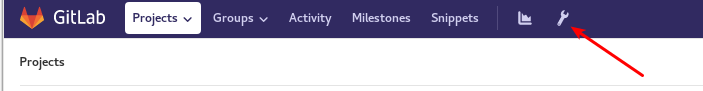
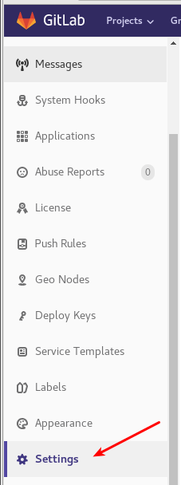
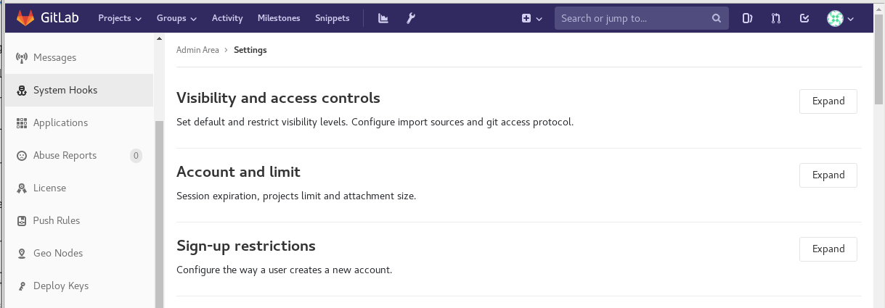
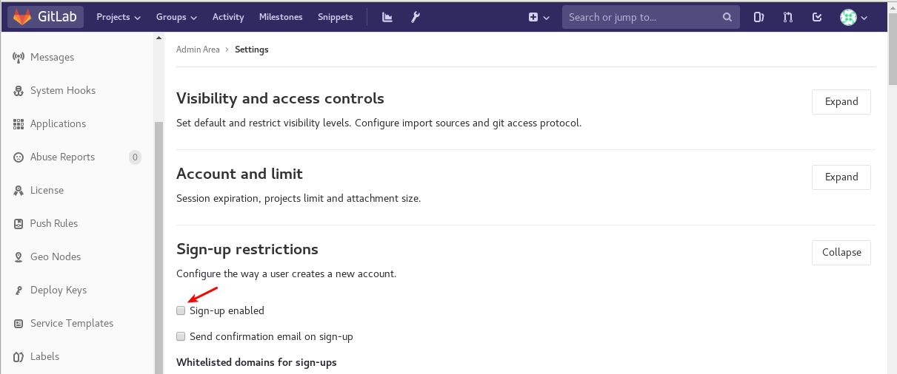
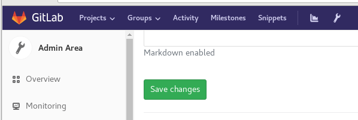
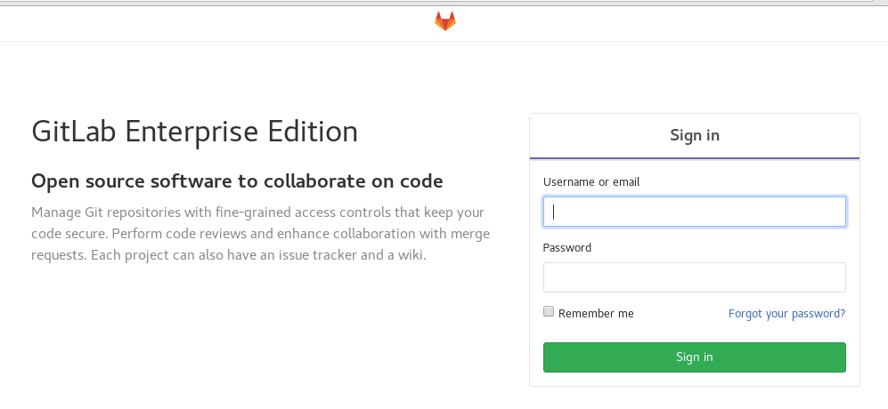
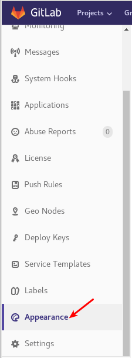
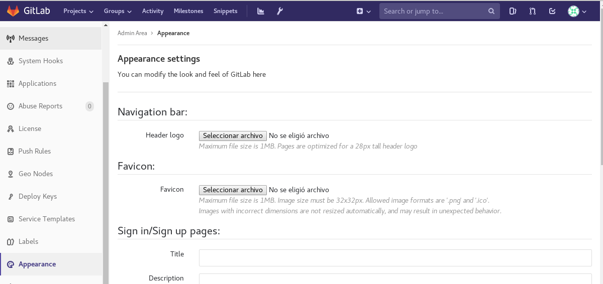
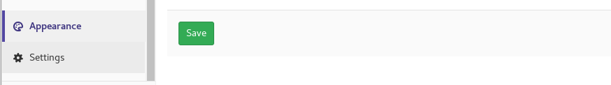
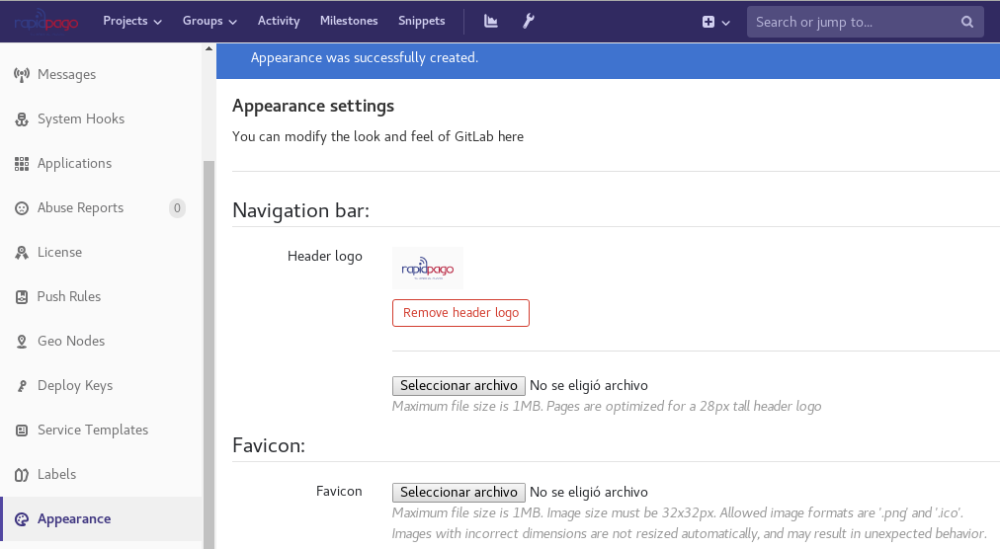

Personalizar GitLab Enterprise Edition
======================================

Eliminar Register
++++++++++++++++++++

Lo primero que debemos hacer es eliminar el autoregistro, para tener una administración centralizada.

Ingresamos con algún súper usuario y buscamos Admin área.

Buscamos Setting.

Y luego buscamos Sign-up restrictions y ahí deshabilitamos el registro automático

Quitamos el check de Sign-up enabled y salvamos

Y ya tenemos solo el Sing in, ya no esta el area de Register

Los siguientes cambios los vamos hacer todos en "Appearance"

Cambiar el Header Logo de Navigation bar
+++++++++++++++++++++++++++++++++++++++++

En "Navigation bar:" seleccionamos el botón "Seleccionar Archivo" y buscamos nuestra imagen, la seleccionamos y salvamos.

Nos desconectamos para ver los cambios.

.. figure:: ../images/14.png

Cambiar el icono de Favicon
++++++++++++++++++++++++++++

Cambiar Logo de Sign in/Sign up pages
+++++++++++++++++++++++++++++++++++++

