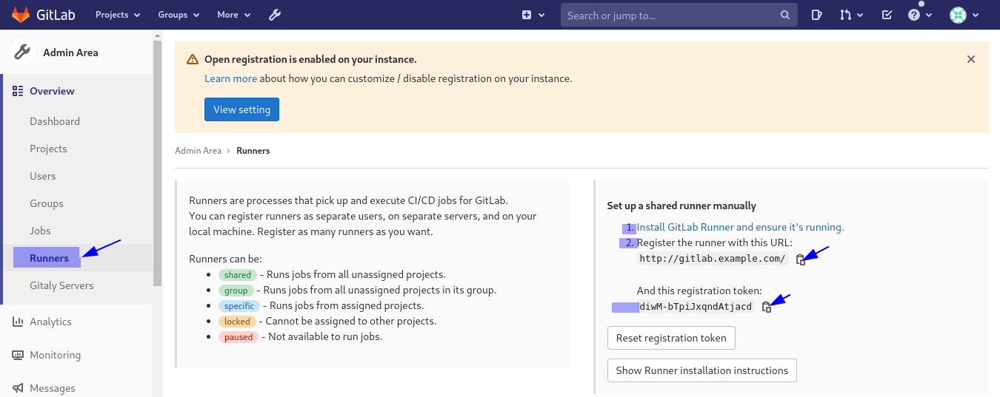

Registrando GitLab-Runner
============

El registro de un runner es el proceso que vincula al runner con una instancia de GitLab.

Requerimientos
+++++++++++

Antes de registrar un runner, primero debe tener esta información que se obtiene del servidor en donde tiene el Gitlab:

Obtener el Token::

	Para un runner compartido, haga que un administrador vaya al Área de administración de GitLab y haga clic en Overview -> Runners

	Para un runner de grupo, vaya a Settings -> CI / CD y expanda la sección Runners

	Para un runner específico del proyecto, vaya a Settings -> CI / CD y expanda la sección Runners

Esta es la imagen para obtener los datos para el runner compartido, que es el que utilizaremos en este documento.

Docker
+++++++++++

Las instrucciones de esta sección están diseñadas para usarse después de instalar GitLab-Runner en un contenedor de Docker.

Los siguientes pasos describen el lanzamiento de un contenedor gitlab-runner de corta duración para registrar el contenedor que creó durante la instalación. Una vez que finaliza el registro, la configuración resultante se escribe en el volumen de configuración elegido (por ejemplo, /srv/gitlab-runner/config) y el runner la cargará utilizando ese volumen de configuración.

Si tiene el Gitlab-runner en ejecucion detengalo::

	docker ps
	docker stop gitlab-runner

1.- Para registrar un runner usando un contenedor Docker:

Para montajes de volumen del sistema local::

	docker run --rm -it -v /srv/gitlab-runner/config:/etc/gitlab-runner gitlab/gitlab-runner register

Para montajes de volumen de Docker::

	docker run --rm -it -v gitlab-runner-config:/etc/gitlab-runner gitlab/gitlab-runner:latest register

2.- Ingrese la URL de su instancia de GitLab (también conocida como la URL del coordinador de gitlab-ci).
3.- Ingresa la ficha que obtuviste para registrar al runner.
4.- Ingrese una descripción para el runner. Puede cambiar este valor más adelante en la interfaz de usuario de GitLab.
5.- Ingrese las etiquetas asociadas con el runner, separadas por comas. Puede cambiar este valor más adelante en la interfaz de usuario de GitLab.
6.- Proporcione el ejecutor del runner. Para la mayoría de los casos de uso, ingrese docker.
7.- Si ingresó docker como su ejecutor, se le pedirá que la imagen predeterminada se use para proyectos que no definen una en .gitlab-ci.yml.

Este seria el ejemplo de ejecutar el comando y con la salida de la ejecución::

docker run --rm -it -v /home//srv/gitlab-runner/config:/etc/gitlab-runner gitlab/gitlab-runner register
Runtime platform                                    arch=amd64 os=linux pid=7 revision=2ebc4dc4 version=13.9.0
Running in system-mode.                            
                                                   
Enter the GitLab instance URL (for example, https://gitlab.com/):
http://192.168.1.3
Enter the registration token:
diwM-bTpiJxqndAtjacd
Enter a description for the runner:
[0d9a175be9d3]: My Runner Example
Enter tags for the runner (comma-separated):
Runner-Tag
Registering runner... succeeded                     runner=diwM-bTp             
Enter an executor: ssh, virtualbox, docker+machine, docker-ssh+machine, custom, docker, parallels, shell, kubernetes, docker-ssh:
docker
Enter the default Docker image (for example, ruby:2.6):
gitlab/gitlab-ce
Runner registered successfully. Feel free to start it, but if it's running already the config should be automatically reloaded! 

Linux
+++++

Para registrar un runner en Linux:

1.- Ejecute el siguiente comando::

	sudo gitlab-runner register

2.- Ingrese la URL de su instancia de GitLab (también conocida como la URL del coordinador de gitlab-ci).
3.- Ingresa la ficha que obtuviste para registrar al runner.
4.- Ingrese una descripción para el runner. Puede cambiar este valor más adelante en la interfaz de usuario de GitLab.
5.- Ingrese las etiquetas asociadas con el runner, separadas por comas. Puede cambiar este valor más adelante en la interfaz de usuario de GitLab.
6.- Proporcione el ejecutor del runner. Para la mayoría de los casos de uso, ingrese docker.
7.- Si ingresó docker como su ejecutor, se le pedirá que la imagen predeterminada se use para proyectos que no definen una en .gitlab-ci.yml

Comando de registro de una línea
+++++++++++++++++

Si desea utilizar el modo no interactivo para registrar un runner, puede utilizar los subcomandos de registro o utilizar sus variables de entorno equivalentes.

Para mostrar una lista de todos los subcomandos de registro, ejecute el siguiente comando::

	gitlab-runner register -h

Para registrar un runner usando las opciones más comunes, deberías hacer::

	sudo gitlab-runner register \
	  --non-interactive \
	  --url "https://gitlab.com/" \
	  --registration-token "PROJECT_REGISTRATION_TOKEN" \
	  --executor "docker" \
	  --docker-image alpine:latest \
	  --description "docker-runner" \
	  --tag-list "docker,aws" \
	  --run-untagged="true" \
	  --locked="false" \
	  --access-level="not_protected"

Si está ejecutando el runner en un contenedor de Docker, el comando de registro tiene una estructura similar a la siguiente::

	docker run --rm -v /srv/gitlab-runner/config:/etc/gitlab-runner gitlab/gitlab-runner register \
	  --non-interactive \
	  --executor "docker" \
	  --docker-image alpine:latest \
	  --url "https://gitlab.com/" \
	  --registration-token "PROJECT_REGISTRATION_TOKEN" \
	  --description "docker-runner" \
	  --tag-list "docker,aws" \
	  --run-untagged="true" \
	  --locked="false" \
	  --access-level="not_protected"

El parámetro --access-level se agregó en GitLab Runner 12.0. Utiliza un parámetro de API de registro introducido en GitLab 11.11. Utilice este parámetro durante el registro para crear un runner protegido. Para un runner protegido, use el parámetro --access-level = "ref_protected". Para un runner desprotegido, use --access-level = "not_protected" en su lugar o deje el valor sin definir. Este valor se puede activar o desactivar más tarde en el menú Configuración> CI / CD del proyecto.
